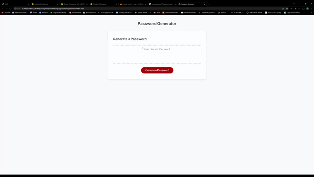
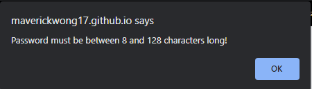
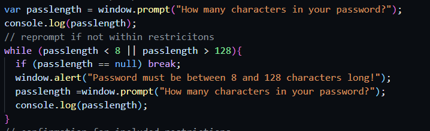

# password-generator

## Description 

### [Deployed Link](https://maverickwong17.github.io/password-generator/).

This is a password generator that prompts the user for certain criteria. Those criteria include character length as well as whether or not to include certain character sets. The sets are uppercase, lowercase, numbers, and special characters.

## Table of Contents 

* [Installation](#installation)
* [Usage](#usage)
* [Credits](#credits)
* [License](#license)

## Installation

Use depoyed link provided above or if you would like your own local version, clone the git repository and run index.html

## Usage 

To use, click the generate passwords button. Answer the prompt for how many characters and confirm or cancel the criteria alerts to add which character sets to include. Please refer below to see demo. 

There is also code for data validation. If the password length is less than 8 or more than 128, the following error shows up.

This alert is shown in a while loop that reprompts with a break if you cancel.

There is also validation for if you do not include any data set.

## Credits

[w3 Schools](https://www.w3schools.com/).

[mdn web docs](https://developer.mozilla.org/en-US/).

## License

MIT license

---

🏆 The sections listed above are the minimum for a good README, but your project will ultimately determine the content of this document. You might also want to consider adding the following sections.

## Technologies used

Javascript

CSS

HTML

## Contributing

Sufiyaan Vaidya

Phil Besse
